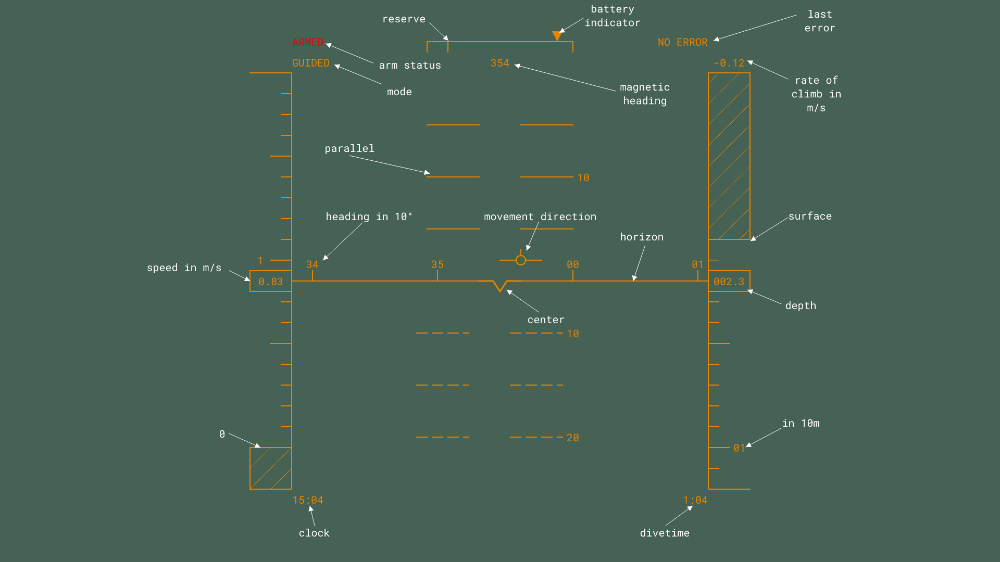

# SIMLASUB UI

Heads up display for steering SIMLASUB an ArduSub based ROV.\
Using a heads-up display like:

Features to implement:

- [x] canvas Element
- [x] virtual Horizon
- [x] depth indicator
- [x] compass
- [ ] speed indicator
- [ ] movement vector
- [ ] text stuff
- [ ] communication stack
