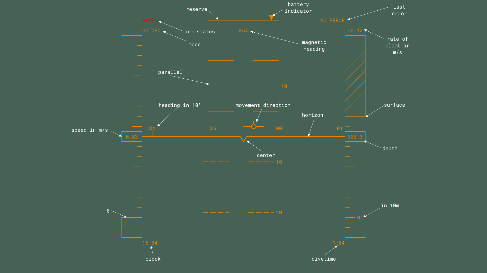

# SIMLASUB UI

The View of a ROV in a lake can be bad (e.g. [Youtube-Video](https://youtu.be/XtH9DfctaJk)).
To improve spatial awareness a UI inspired by Airplane HUD is developed here.

Heads up display for steering SIMLASUB an ArduSub based ROV.

Features to implement:

- [x] canvas Element
- [x] virtual Horizon
- [x] depth indicator
- [x] compass
- [x] speed indicator
- [x] movement vector
- [ ] text stuff
- [ ] video stream
- [ ] steering data

Concept Art:

